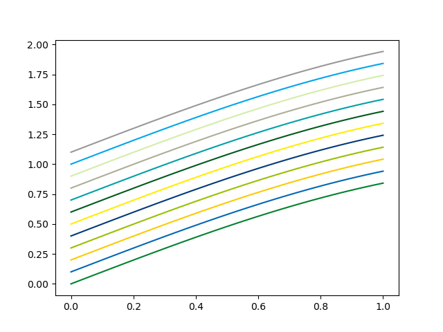

# unb_matplotlib
Repositório não-oficial de paletas de cores da Universidade de Brasília para matplotlib.
Baseado no Manual de Identidade Visual disponível em https://www.cic.unb.br/images/marca-cic/Manual_Identidade_Visual_UnB.pdf.

## Como usar 

Arquivo `unb_colors.gpl` está no formato GIMP Color Pallete e pode ser importado para programas de edição gráfica 
como GIMP e Inkscape.

Arquivo `unb_colors.py` deve ser copiado no diretório em que está trabalhando. 
```python
import unb_colors
# Para acessar as cores, basta usar o dicionário
dict_cores = unb_colors.unb_colors
# Para atualizar as configurações do Matplotlib
unb_colors.update_colors()
```
# Exemplo

